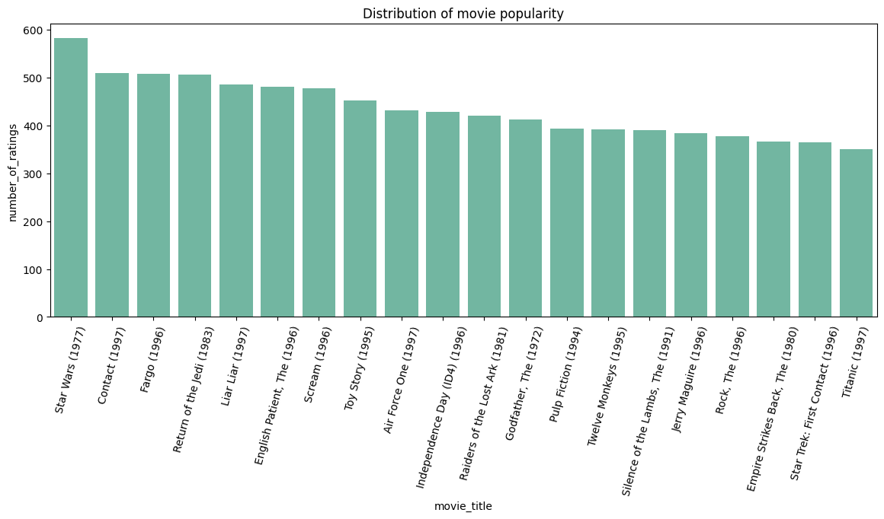

# MovieLens 100k RecSys Report

## Introduction

This report is the final report for the MovieLens 100k RecSys project. The goal of this project is to build a movie recommendation system based on the MovieLens 100k dataset using ml-based and dl-based approaches. The report is organized as follows:

## Contents

- [MovieLens 100k RecSys Report](#movielens-100k-recsys-report)
  - [Introduction](#introduction)
  - [Contents](#contents)
  - [Data analysis](#data-analysis)
    - [Dataset desctiption](#dataset-desctiption)
    - [Exploratory Data Analysis](#exploratory-data-analysis)
  - [Model Implementation](#model-implementation)
  - [Model Advantages and Disadvantages](#model-advantages-and-disadvantages)
    - [Advantages of SAR](#advantages-of-sar)
    - [Disatvantages of SAR](#disatvantages-of-sar)
  - [Training Process](#training-process)
  - [Evaluation](#evaluation)
  - [Results](#results)
  - [References](#references)

## Data analysis

### Dataset desctiption

The dataset contains 100,000 ratings from 943 users on 1682 movies. Each user has rated at least 20 movies. The data was collected through the MovieLens web site (movielens.umn.edu) during the seven-month period from September 19th, 1997 through April 22nd, 1998. This data has been cleaned up - users who had less than 20 ratings or did not have complete demographic information were removed from this data set. Detailed descriptions of the dataset can be found [here](http://files.grouplens.org/datasets/movielens/ml-100k-README.txt).

### Exploratory Data Analysis

> Note: for detailed data analysis, please refer to [this notebook](../notebooks/01-initial-data-exploration.ipynb)

Exploraing the dataset was straightforward and here are some inshights I was able to get from the data:

According to the following graph, the most popular rating is 4, followed by 3 and 5. The least popular rating is 1.

The following graph shows the distribution of ratings per user. As we can see, most users have rated between 20 and 100 movies.

Distribution of ages of users and occupations is not that surprising. Most users are between 20 and 40 years old and most of them are students.

| Age | Occupation |
| --- | ---------- |
|||

Lastly, top 20 movies are:

Those were some useful insights that I was able to get from the data, however there were not particularly useful for the model implementation, since I am not making any assumptions about the data while implementing the model.

## Model Implementation

> Note: for detailed model implementation, please refer to [this notebook](../notebooks/02-sar.ipynb)

For the model implementation, I decided to use the [microsoft-recommenders](https://github.com/recommenders-team/recommenders/) library. The library is a toolkit for building recommender systems, providing a set of pre-built models, evaluation metrics, and extensive documentation. The library is built on top of PyTorch and supports both CPU and GPU training. The library also provides a set of pre-built models, one of which is SAR (Simple Algorithm for Recommendation).

Basically, SAR is a memory-based collaborative filtering algorithm that computes the similarity between items based on the co-occurrence of items in user transactions. The algorithm is described in detail in the following paper: [Simple Algorithm for Recommendation: 1000x Speedup with Apache Spark](https://arxiv.org/abs/1801.00076).

## Model Advantages and Disadvantages

### Advantages of SAR

- High accuracy for an easy to train and deploy algorithm
- Fast training, only requiring simple counting to construct matrices used at prediction time.
- Fast scoring, only involving multiplication of the similarity matrix with an affinity vector

### Disatvantages of SAR

- Since it does not use item or user features, it can be at a disadvantage against algorithms that do.
- It's memory-hungry, requiring the creation of an $mxm$ sparse square matrix (where $m$ is the number of items). This can also be a problem for many matrix factorization algorithms.
- SAR favors an implicit rating scenario and it does not predict ratings.

## Training Process

> Note: for detailed training process, please refer to [this notebook](../notebooks/02-sar.ipynb)

The training process for SAR is just to compute 2 matrices: the affinity matrix $A$ and the similarity matrix $S$. The result is a ***recommendation score matrix*** $R$ from which the top-k recommendations can be extracted.

## Evaluation

I am evaluating `SAR` using 4 metrics (because, why not), which are `MAP@10` (Mean Average Precision), `NDCG@10` (Normalized Discounted Cumulative Gain), `Precision@10`, and `Recall@10`.

But for the final results, though I will use `Precision@10`, because it is the most important metric for my use case. I chose it because I think, that it is better to recommend less items, but with higher probability that the user will like them, than to recommend more items, which the user will not like.

Here are the results of my evaluation:

| Model | Top K | MAP | NDCG | Precision@K | Recall@K |
| ----- | ----- | --- | ---- | ----------- | -------- |
| SAR | 10 | 0.110591 | 0.382461 | 0.330753 | 0.176385 |

## Results

I was able to achieve `Precision@10` of `0.330753` using `SAR` model. I think that this is a good result, considering that I did not do any hyperparameter tuning and the fact that the model is very simple. Overall, I am satisfied with the results.

## References

- [MovieLens 100k dataset](https://grouplens.org/datasets/movielens/100k/)
- [MovieLens 100k dataset description](http://files.grouplens.org/datasets/movielens/ml-100k-README.txt)
- [microsft-recommenders](https://github.com/recommenders-team/recommenders/)
- [Simple Algorithm for Recommendation: 1000x Speedup with Apache Spark](https://arxiv.org/abs/1801.00076)
